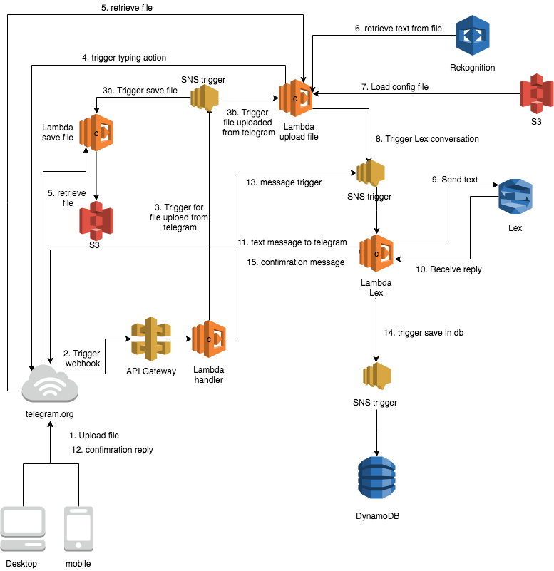
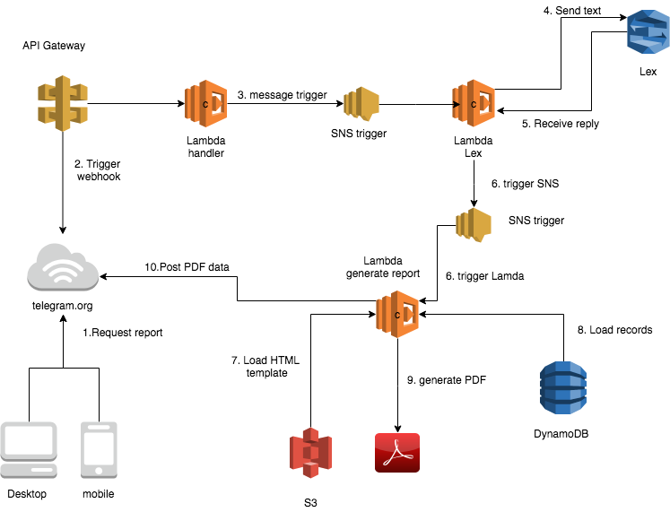

# Telegram ExpenseBot Example

The example demonstrates a Telegram bot that uses the Amazon Lex & Amazon Rekognition service, and the deployment needed for Telegram bots in general.

This example uses the following Amazon Services
 - **Amazon Simple Storage Service (S3)** - Store receipts and configuration files
 - **Amazon DynamoDB**- Store attributes from a receipt
 - **Amazon API Gateway** - API connectivity with Telegram.org
 - **Amazon Simple Notification Service (SNS)** - Coordinating the delivery of messages to subscribing endpoints between the different micro services
 - **Amazon Lex** - Amazon Lex for building conversational interfaces with the user application using text.
 - **Amazon Rekognition** - Text recognition service for receipt attributes
 - **AWS Lambda** - Run code without provisioning or managing servers

## Capabilities
### 1. Receipt upload from telegram



### 2. Generate PDF report



## Installation
I have written the installation steps for OS X & Linux:

### Step 1. Clone GitHub repository

```sh
npm install -g serverless
install the AWS Command Line Interface
git clone git://github.com/yourname/github-link
cd github-link
npm install
serverless deploy
```

### Step 2. config files
Upload config.json and template.html to config S3 bucket

### Step 3 Set telegram API
1. [Register telegram bot with Telegram.org](https://core.telegram.org/bots#botfather)
2. Set the webhook, based URL endpoint mentioned in "Step 1. Clone GitHub repository"
3. Create an empty file called serverless.env.yml with the content below.
```yaml
dev:
    TELEGRAM_API: '<TELEGRAM API>'
```

### Step 4. Create a Lex bot using the Amazon web console
For building out your Lex chatbot, follow the instructions for [building a lex bot](BUILDLEXBOT.md).

## Usage example

1. Add your bot in Telegram client
2. Enter `Welcome` or `Help`
3. Enter `I want to do a expense claim`

## Package dependencies
 - [moment](http://momentjs.com/docs/)
 - [request](https://github.com/request/request)
 - [request-promise](https://github.com/request/request-promise)
 - [sharp](https://github.com/lovell/sharp)
 - [uuid](https://github.com/kelektiv/node-uuid)
 - [handlebars](https://github.com/wycats/handlebars.js)
 - [sharp](https://github.com/lovell/sharp)
 - [wkhtmltopdf](https://github.com/devongovett/node-wkhtmltopdf)

## Release History

* 0.0.1
    * Work in progress

## Meta

Onno Bos – twitter [@obeone](https://twitter.com/obeone)

Distributed under the GNU GPLv3 license. See ``GNU GPLv3`` for more information.

[https://github.com/yourname/github-link](https://github.com/dbader/)
